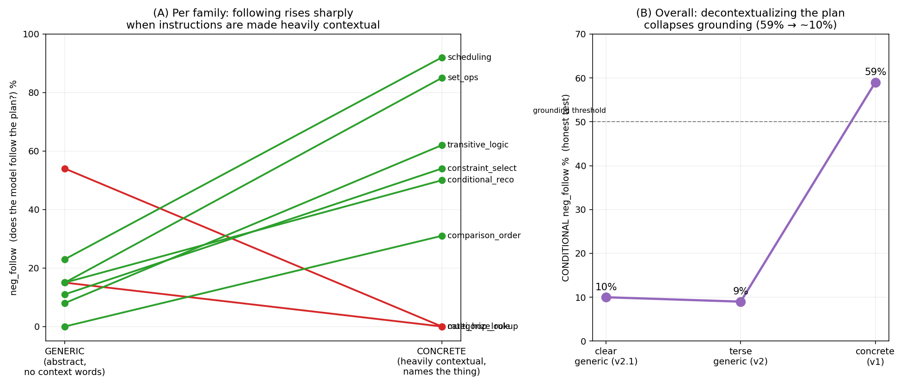
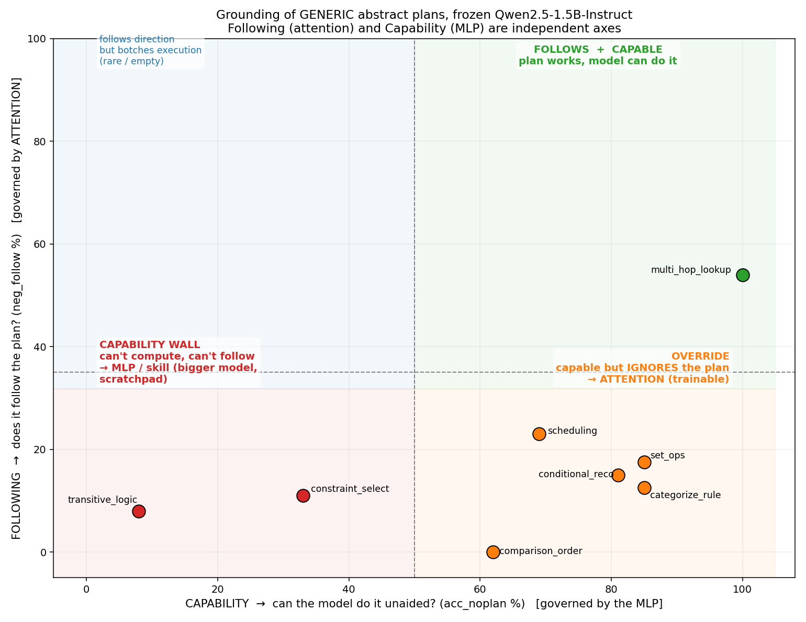

# Can a frozen small model follow an abstract plan? — grounding probe results

**Model:** `Qwen2.5-1.5B-Instruct`, **frozen** — no training, no LoRA, no gradients. Pure inference.
**Method:** for each problem, greedy-decode three ways — with the **gold** plan, with **no** plan, and
with a one-step-perturbed **wrong** plan — and check whether the wrong plan drags the model to *its*
(known, by-construction) wrong answer. All answers are computed by per-topic Python solvers, so grading
needs **no LLM judge**. Code: `grounding_test.py`, `tools/gen_grounding_*.py`. 100 examples, 8 topics.

Metrics (the wrong-plan decode is what isolates plan-causation):
- `acc_plan` — gold plan → gold answer
- **`neg_follow`** — wrong plan → *that wrong plan's* answer = **the model FOLLOWED the plan** (HIGH = good)
- **`neg_to_gold`** — wrong plan → gold answer = the model **ignored** the plan (LOW = good)
- `acc_noplan` — no plan → gold answer = how often the plan is even **needed** / the model's intrinsic skill

The honest number is **conditional**: restricted to rows the model fails unaided (`acc_noplan == 0`),
where the plan is actually load-bearing.

## Headline: concrete plans ground; abstract plans do not — and phrasing doesn't fix it

| plan style | conditional `neg_follow` | verdict |
|---|---|---|
| **Concrete** ("Keep only the gadgets that are *waterproof*") | **59%** | GROUNDING WORKS |
| Terse generic ("the 1st stated requirement") | 9% | weak/absent |
| **Clear** generic (fuller natural English, still positional) | ~10% | weak/absent |

A frozen 1.5B **follows concrete English plans** but **cannot ground abstract, positional ones** — and
rewriting them in clearer, fuller English did **not** help. The binding "the 1st stated requirement →
waterproof" does not come for free.



*(A) Per family, following rises sharply as instructions are made heavily contextual (concrete).
(B) Overall: decontextualizing the plan collapses grounding from 59% to ~10%.*

## But it's not uniform — there are three classes of problem

Following a plan needs **two independent things**: the model must **LISTEN** to the plan (weight it over
its own instinct) **and** be **ABLE** to execute the operation it directs. Plotting **Following** (does it
follow the plan?) against **Capability** (can it do the operation unaided?) splits the topics into three
clean clusters:



| cluster | topics | what's happening | the likely fix |
|---|---|---|---|
| **Follows + capable** | `multi_hop_lookup` | plan attended, operation easy (a labelled-slot lookup) — it follows the wrong plan *even though it could solve it unaided* | already works |
| **Override** (capable, ignores plan) | `set_ops`, `categorize_rule`, `conditional_reco`, `scheduling`, `comparison_order` | the model *can* do the op, so it solves the problem its own way and **ignores** the wrong plan (high `neg_to_gold`) | **attention** — teach it to weight the plan (instruction-following / contrastive SFT) |
| **Capability wall** (can't, so can't follow) | `transitive_logic`, `constraint_select` | the operation (build a total order from scattered facts) **exceeds the 1.5B**, so it can neither solve nor follow (high "other") | **MLP / skill** — bigger model, or let it write a scratchpad |

### The hypothesis the axes encode
- The **Following** axis looks **attention-governed**: the *override* failures are a model that doesn't
  give the plan enough weight against its own confident answer. This is **trainable** (we separately
  raised `neg_follow` to ~67% by contrastive-SFT-ing an executor to follow plans).
- The **Capability** axis looks **MLP-governed**: `transitive_logic` (`acc_noplan = 8%`, `neg_follow = 8%`)
  can't compute the ranking the plan refers to, so no amount of attention to the plan helps.

The cleanest single cell: **`transitive_logic`** — needed (can't solve unaided) *and* not followed. That's
the capability wall. The cleanest success: **`multi_hop_lookup`** — a labelled-slot lookup grounds even
generically, and the model follows the "skip a hop" instruction *against* its own correct answer.

## What this means for a reusable primitive vocabulary

Zero-shot abstract primitives are **not** uniformly viable on a frozen 1.5B — but the split is actionable:
- **Easy primitives** (LOOKUP, simple labelled FILTER) ground **zero-shot** — no training needed.
- **Override-class primitives** (SET_OP, BRANCH on a described condition) need **attention training**
  (teach the model to weight the plan) — the distill-from-concrete-English bootstrap.
- **Capability-class primitives** (global reasoning: CHAIN/ORDER over scattered facts) need a **bigger
  executor or a scratchpad**; attention training alone won't fix them.

So a universal vocab is a **hybrid**: train only the override-class primitives, leave the easy ones
zero-shot, and give the capability-class ones a stronger executor.

## Reproduce

```bash
# generate data + run the frozen probe (concrete and generic variants)
python tools/gen_grounding_data.py   --n 100 --out grounding_test_data.jsonl          # v1 concrete
python tools/gen_grounding_blocks.py --club 1 --out grounding_blocks_c1.jsonl          # v2.1 generic
python grounding_test.py --data grounding_test_data.jsonl --out grounding_out          # frozen probe
python tools/plot_grounding_results.py                                                 # regenerate these figures
```

Notebooks: `grounding_test.ipynb` (concrete) and `grounding_blocks.ipynb` (generic + clubbing).
